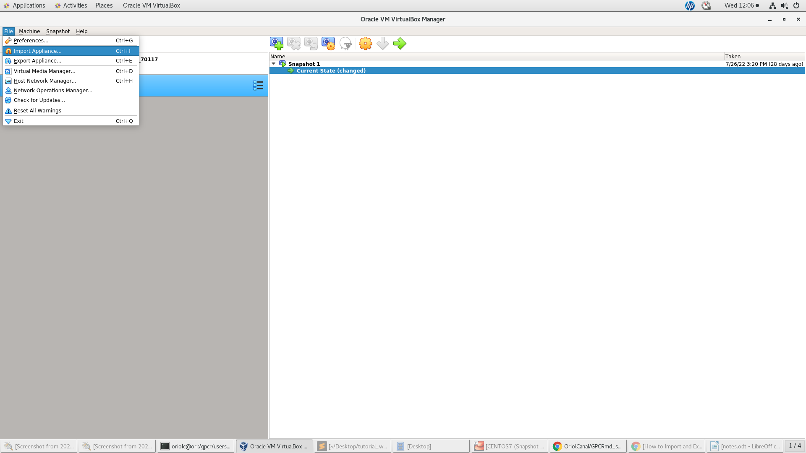
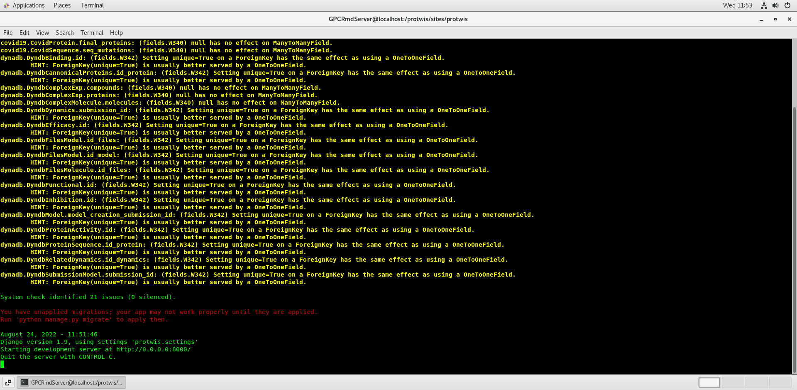
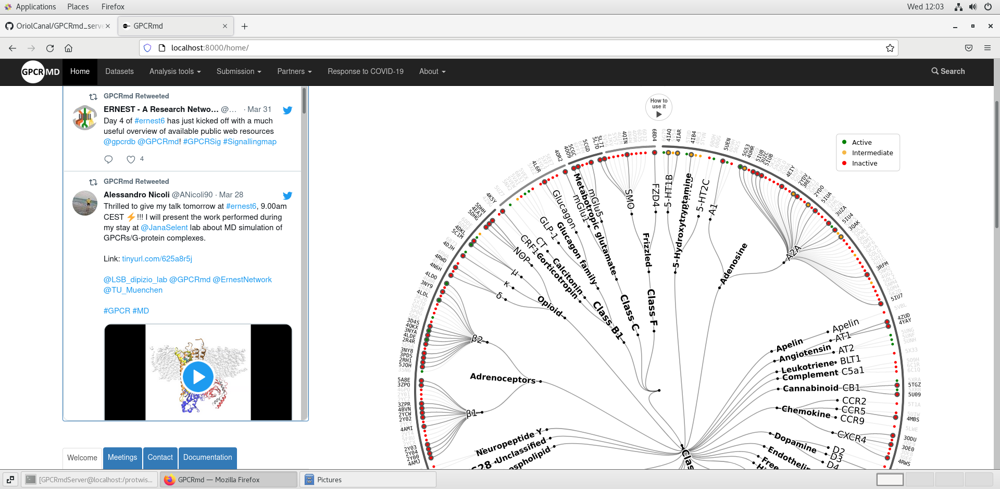
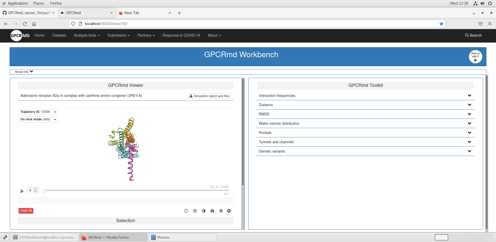

# GPCRMD_VIRTUAL_MACHINE_SERVER

The main advantage of working with a virtual machine is their portability as it's easy to be able to create VMs on one machine and move them to another or create a clone. Here we have pre-configured a virtual machine that you can import in a snap and get working right away. Here we will show you how to import the OVA file of the GPCRmd server in VirtualBox.

## WHAT IS AN OVA FILE?

An OVA (Open Virtual Appliances) file is a package that contains files used to describe a virtual machine. So, it is used to set up virtual machines through software like VirtualBox. In this case the OVA file created will have all the installation required for the GPCRmd server to run properly. In this way, you will be able to obtain a GPCRmd development server without having to spend time with the installation procedure.

## IMPORTING THE OVA FILE

You can obtain the OVA file of the GPCRmd server in the following path:

```
/gpcr/users/shared/GPCRmd_virtual_machine_backup/
```
Here you will find a file called backup_virtualMachine_GPCRmd.ova. You will have to copy this file in the machine you want to install your GPCRmd developer server. You can do creating a tunnel via ssh and copying the file as follows (changing the "username" by your real username :) ):
```
ssh -f -X username@zeus.upf.edu -N -L 5555:boromir.prib.upf.edu:22
scp -r -P 5555 username@localhost:/gpcr/users/shared/GPCRmd_virtual_machine_backup/backup_virtualMachine_GPCRmd.ova .
```
It can take some time to copy the file to your final destination.

## VIRTUALBOX INSTALLATION

Execute the following commands to install and run virtualbox (if you are using ubuntu repository):

```
sudo apt-get update
sudo apt-get install virtualbox
sudo apt-get install virtualbox—ext–pack
```
Then, you should accept the Licenses selecting <ok> and <Yes> buttons.

Finally you can open virtualbox using the following command:

```
virtualbox
```


## OVA FILE INSTALLATION:

Once you have your VirtualBox running, click on "File" in the top menu and then select "Import Appliance...".



A new window will pop open with a field to select your .ove file. Browse to the directory where you copied the backup_virtualMachine_GPCRmd.ova file. Once selected click on next.

Then it will appear a window where you can choose the key features of the virtual machine (e.g. CPU, RAM ....). Finally click on import button and it can take some time (30 min aprox) to complete the process. After the process completes your Virtual Machine will be ready to use.

## IMPORTANT FEATURES TO KNOW!

When you open your Virtual Machine, you will have to log in as **GPCRmdServer** user. It's password is: **GPCRmd**. Here you will have all the installation required for the GPCRmd server to run.

In order to run the server you should go to the following directory:

```
cd /protwis/sites/protwis/
```
and here you should execute the following command:

```
python manage.py runserver 0.0.0.0:8000
```
It will take some seconds to execute. You should left this command executing in the terminal. Something like this should appear:



Then you can go to your browser and go to the following URL:

[localhost:8000/home/](http://localhost:8000/home/)
 
If all works properly you should go to the main menu of GPCRmd:
 

 
 If you need to go to an example of the GPCRmd workbench you should use the dynID 36 as it is the only one that has the trajectories included in the virtual machine (due to memory reasons). You can go directly there using the following url:
 
 [localhost:8000/view/36/](http://localhost:8000/view/36/)
 
 and you should be able to access to a workbench example:
 
 


**UNTIL HERE IS ALL YOU NEED TO KNOW ABOUT THE INSTALLATION OF GPCRmd SERVER. THE FOLLOWING SECTIONS ARE ABOUT HOW TO VIRTUAL MACHINE WAS CONFIGURED AND YOU DON'T NEED IT UNLESS YOU FIND WITH A CONFIGURATION ISSUE**
 
 **GOOD LUCK AND I HOPE THIS LITTLE TUTORIAL HAS HELPED YOU WITH THE INSTALLATION OF THE GPCRmd SERVER :)**


## HOW TO CREATE A VIRTUAL MACHINE TO INSTALL GPCRMD SERVER:

Download the latest version of [Virtualbox](https://www.virtualbox.org/wiki/Downloads)

Open virtualbox:
```
virtualbox
```

Create a CentOS7 machine in virtualbox. In this [link](https://www.saltos.org/portal/en/wiki/view/358/installing-centos-7-in-virtualbox) you have a tutorial that you can follow. 
Give at least 50GB of memory to your virtual machine.

Start your virtual machine:
give internet connexion and change the keyboard to a convenient one in the installation step. In addition, create a user with all permisions. 
 
I also recommend to activate the GNOME graphical interface.

Once we have started the virtual machine the mouse will be stuck to the virtual machine. Using ctrl (the right one on the keyboard we will be able to return the mouse to our graphical interface). In addition using ctrl (right one) + f we will be able to use full screen.

We install guest additions. Here you have a [tutorial](https://linuxconfig.org/how-to-install-virtualbox-guest-additions-on-centos-7-linux) on how to install and run it.

To make sure that we have properly installed the CentOS7 machine in virtualbox just type in terminal:

```
cat /etc/redhat-release 
```
It should indicate that you have CentOS Linux release 7.*.* (Core)

### MINICONDA ENVIRONMENT

Download the miniconda environment that you have to use for the GPCRmd server from [here](https://drive.google.com/file/d/1CfuIF9nuCafYJLvtOtyh4gKxyhyvoOJt/view?usp=sharing).

Uncompress the file and copy the miniconda3 folder to /opt:
```
tar -xzvf miniconda-installation.tgz
cp miniconda3 /opt/miniconda3
```
And activate the environment:

```
export PATH=/opt/miniconda3/bin:$PATH
source activate
```
## APACHE CONFIGURATION 

We install apache:

```
yum install httpd httpd-devel -y
systemctl enable httpd.service
```


Turn on the service 
```
systemctl enable httpd
systemctl start httpd
```

We adjust rules of thefirewall:

```
firewall-cmd --add-service=http
firewall-cmd --add-service=http --permanent
firewall-cmd --add-service=https
firewall-cmd --add-service=http --permanent
```

Install mod-wsgi:
```
/opt/miniconda3/bin/pip  install mod_wsgi
```
Execute:
```
mod_wsgi-express module-config
```
This will show in terminal what we have to put on the apache configuration, something like: LoadModule wsgi_module "/opt/miniconda3/lib/python3.4/site-packages/mod_wsgi/server/mod_wsgi-py34.cpython-34m.so"
WSGIPythonHome "/opt/miniconda3"

We add it to the apache configuration file which we will give the name of the webservice (change the LoadModule.... with the output of the previous command):

```
cat /etc/httpd/conf.d/gpcrmd.conf LoadModule wsgi_module "/opt/miniconda3/lib/python3.4/site-packages/mod_wsgi/server/mod_wsgi-py34.cpython-34m.so"
WSGIPythonHome "/opt/miniconda3"
```

Restart the server to see if the module can load it:

```
systemctl restart httpd
systemctl status httpd
```
The service should be running correctly.


## PACKAGES INSTALLATION
Install the following packages using yum:

```
sudo yum install epel-release centos-release-scl -y

sudo yum -y install cmake sqlite sqlite-devel tcl-devel tk-devel readline-devel bzip2-devel libtiff-devel freetype-devel libwebp-devel lcms2-devel cairo mod_xsendfile openblas-threads git openbabel expect htop wget clustal-omega perl-Archive-Tar perl-Digest-MD5 perl-List-MoreUtils argtable argtable-devel java-1.8.0-openjdk java-1.8.0-openjdk-devel logrotate curl PyYAML libyaml libyaml-devel libffi libffi-devel libjpeg-turbo-devel zlib zlib-devel libicu libicu-devel perl cmake sqlite sqlite-devel tcl-devel tk-devel readline-devel bzip2-devel libtiff-devel freetype-devel libwebp-devel lcms2-devel cairo
```
## NCBI BLAST

Install NCBI Blast:

```
wget  https://ftp.ncbi.nlm.nih.gov/blast/executables/blast+/2.11.0/ncbi-blast-2.11.0+-1.x86_64.rpm
sudo yum localinstall ncbi-blast-2.11.0+-1.x86_64.rpm -y
```

## POSTGRESQL INSTALLATION FROM POSTGRES WEBPAGE
Here you have a [link to go to the postgresql webpage](https://www.postgresql.org/download/linux/redhat) where you will find all the instructions to create a postgreSQL Yum repository. Install version 10 of postgresql. 

Here I put the instructions from the link to Install version 10 :

```
# Install the repository RPM:
sudo yum install -y https://download.postgresql.org/pub/repos/yum/reporpms/EL-7-x86_64/pgdg-redhat-repo-latest.noarch.rpm

# Install PostgreSQL:
sudo yum install -y postgresql10-server

# Optionally initialize the database and enable automatic start:
sudo /usr/pgsql-10/bin/postgresql-10-setup initdb
sudo sed -i 's/ident/md5/g' /var/lib/pgsql/10/data/pg_hba.conf 


sudo systemctl enable postgresql-10
sudo systemctl start postgresql-10

```

## SOLR INSTALLATION:


```
curl -sLO https://archive.apache.org/dist/lucene/solr/6.4.2/solr-6.4.2.tgz
tar xzf solr*.tgz solr*/bin/install_solr_service.sh --strip-components=2
bash ./install_solr_service.sh solr*.tgz -f
mkdir -p /var/solr/data/collection_gpcrmd/
mkdir -p /var/solr/data/collection_gpcrmd/data
```

You can find the core.properties file [here](https://github.com/OriolCanal/GPCRmd_server_VirtualMachine/blob/main/core.properties)

```
cp core.properties /var/solr/data/collection_gpcrmd/core.properties

ln -s /var/solr/data/collection_gpcrmd/conf /protwis/sites/protwis/solr/collection_gpcrmd/conf/
service solr restart
```

## Install boost >1.58:
```
conda install boost==1.61.0
```

## RDkit

RDKit is a collection of cheminformatics and machine-learning software written in C++ and Python. We can install it executing these commands. We need to have the miniconda environment loaded:

```
wget https://github.com/rdkit/rdkit/archive/Release_2016_03_1.tar.gz
tar -zxvf Release_2016_03_1.tar.gz
cd rdkit-Release_2016_03_1/
export RDBASE=$(pwd)
mkdir build
cd build
source activate 
cmake -D RDK_BUILD_SWIG_WRAPPERS=OFF -D PYTHON_EXECUTABLE=/opt/miniconda3/bin/python -D PYTHON_LIBRARY=/opt/miniconda3/lib/libpython3.so -D PYTHON_INCLUDE_DIR=/opt/miniconda3/include/python3.4m -D RDK_BUILD_AVALON_SUPPORT=ON -D RDK_BUILD_INCHI_SUPPORT=ON -D BOOST_ROOT=/opt/miniconda3 -D PYTHON_INSTDIR=/opt/miniconda3/lib/python3.4/site-packages -DRDK_INSTALL_INTREE=OFF -DCMAKE_INSTALL_PREFIX=/usr/local/rdkit ..
make -j2
sudo make install -j2
```


## GENERATING CERTIFICATES

Create a directory where the certificates will be stored:

```
mkdir certificats
cd certificats
```

```
openssl genrsa -des3 -out server.key 1024
```

We will be asked to enter a pass phrase.


```
openssl req -new -key server.key -out server.csr
```
We enter pass phrase (whatever)
Contry name : ES
State or province name : Bcn
Locality name: Bcn
Organization name: GPCR Lab
Organizational Unit name: GPCR
Common name: gpcr.test
Email adress: xxx@gpcr.test
challange password: whatever2022

```
cp server.key server.key.org
openssl rsa -in server.key.org -out server.key
```
Again we will be asked to enter a pass phrase

```
openssl x509 -req -days 365 -in server.csr -signkey server.key -out server.crt
```
We have generate the certificate : gpcr.crt
and the key: gpcr.key

We copy these files to the conf of apache:

```
cp server.crt /etc/pki/tls/certs/gpcr.crt
cp server.key /etc/pki/tls/private/gpcr.key
```

Ìnstall some packages:
```
yum install openssl-devel
yum install openssl -y
yum install httpd24-mod_ssl
yum install mod_ssl
```

Now in /etc/pki/tls/certs should appear the ssl.conf file

Edit the ssl.conf file using a text editor and include where the certificate (SSLCertificateFile /etc/pki/tls/certs/gpcr.crt) and the key (SSLCertificateKeyFile /etc/pki/tls/private/gpcr.key) can be found. You just have to replace the 2 paragraphs that you have below in the ssl.conf file:

#Server Certificate:  
#Point SSLCertificateFile at a PEM encoded certificate. If     
#the certificate is encrypted, then you will be prompted for a  
#pass phrase.  Note that a kill -HUP will prompt again.  A new  
#certificate can be generated using the genkey(1) command.  
SSLCertificateFile /etc/pki/tls/certs/gpcr.crt  


  
  
    
    
#Server Private Key:  
#If the key is not combined with the certificate, use this  
#directive to point at the key file.  Keep in mind that if  
#you've both a RSA and a DSA private key you can configure  
#both in parallel (to also allow the use of DSA ciphers, etc.)  
SSLCertificateKeyFile /etc/pki/tls/private/gpcr.key  


Finally, you just have to save the file.


## TRANSFER OF GPCRMD FILES

We will transfer a subset of simulations as the virtual machine won't be able to support the whole dataset.

We can download the gpcrmd server from [here](https://github.com/GPCRmd/gpcrdb).

You will need permissions to see and download the contents of the previous github repository.

You download all the data from the github repository.


Create the following directories:

/protwis/sites/protwis

and give permissions to edit their content:

```
chmod 777 /protwis/
```


Unizp the github repository compressed file And store all the unziped files into the /protwis/sites/protwis/ directory:

```
unzip gpcrdb-dev.zip
cd gpcrdb-dev
mv -r * /protwis/sites/protwis/
```

Create a  directory into /protiwis/sites named files where we will store a subset of the GPCRmd database files:
```
cd /protwis/sites
mkdir files
cd files
mkdir Covid19Data
mkdir Model
mkdir Molecule
mkdir Molecule_sc
mkdir Summary
mkdir test
mkdir Covid19Dynamics
```

Now we have to download files from ori using scp (to do this step you need to have a user in ori). You will need to enter the ori user password in every command you execute:

```
scp -r username@ori:/protwis/sites/files/Covid19Data .
scp -r username@ori:/protwis/sites/files/Model .
scp -r username@ori:/protwis/sites/files/Molecule .
scp -r username@ori:/protwis/sites/files/Molecule_sc .
scp -r username@ori:/protwis/sites/files/Summary .
scp -r username@ori:/protwis/sites/files/test .
scp -r username@ori:/protwis/sites/files/Covid19Dynamics .
```

In addition, we also have to copy a subset of dynamics simulations. So we create a Dynamics folder and copy a subset of simulations into it:

``` 
mkdir Dynamics
cd Dynamics
sudo scp -r username@ori:/protwis/sites/files/Dynamics/*dyn_688* .
sudo scp -r username@ori:/protwis/sites/files/Dynamics/*trj_688* .
sudo scp -r username@ori:/protwis/sites/files/Dynamics/*dyn_700* .
sudo scp -r username@ori:/protwis/sites/files/Dynamics/*trj_700* .
```


## CREATING DATABASE

First of all we need to create an user named protwis in postgres:
```
sudo -u postgres createuser -s -P protwis
```
It will request a new password for the user:

"Enter password for new role: "


Now we need to create a database:

```
sudo -u postgres createdb -U protwis -h localhost protwis
```

You will be requested to enter the password that you have created before.


Now we need to connect to postgres (You may need to create a password for root privilegies in postgres):
```
su postgres
```

Inside postgres run:
```
psql
```
Now we are on psql which is a terminal-based front-end to PostgreSQL. Here we need to create an user and the database where the gpcrmd server will be stored. So, run the following commands on psql:
```
CREATE ROLE schedulers
  NOSUPERUSER INHERIT NOCREATEDB NOCREATEROLE NOREPLICATION;
CREATE ROLE scheduler LOGIN
  NOSUPERUSER INHERIT NOCREATEDB NOCREATEROLE NOREPLICATION;
GRANT schedulers TO scheduler;
DROP SCHEMA IF EXISTS public CASCADE;
CREATE SCHEMA public
  AUTHORIZATION postgres;

GRANT ALL ON SCHEMA public TO postgres;
GRANT ALL ON SCHEMA public TO protwis;
GRANT ALL ON SCHEMA public TO public;
COMMENT ON SCHEMA public
  IS 'standard public schema';
CREATE EXTENSION hstore;
```


## DATABASE CREATION

Clone the gpcrmd_vagrant repository from GitHub:
```
git clone --recursive git@github.com:GPCRmd/gpcrmd_vagrant.git ~/gpcrmd_vagrant
cd ~/gpcrmd_vagrant
```

Download the dump07042020.backup file from [here](https://github.com/GPCRmd/gpcrmd_data/releases/tag/v0.3) and copy it into next folder: '~/gpcrmd_vagrant/shared/db/'.
```
cp ~/Downloads/dump07042020.backup ~/gpcrmd_vagrant/shared/db/
```
And create the following link:
```
cd ~/gpcrmd_vagrant/shared/db/
ln -s dump07042020.backup ~/gpcrmd_vagrant/shared/db/dump.backup
```

Finally run:
```
pg_restore -h localhost -U protwis -d protwis ~/gpcrmd_vagrant/shared/db/dump.backup
```
It will request the password and it will take some minutes to be executed. 


## MDSRV SERVER

fa servir servidor independent 

cONFIGURACIO FITXER APACHE, file: 

```
cd /etc/httpd/conf/
gedit httpd.conf
```

We have to include listen 8082 and 8081 also.

Now we have to stop the firewall of centos (seelinux):

https://linuxize.com/post/how-to-disable-selinux-on-centos-7/


Then we have the access to the required ports

all that we have in the folder www is property of apache
```
cd /www
sudo chgrp -r apache *
```

here we have a folder mdrsv that is the server for the visualization of proteins
cd /etc/httpd/conf.d/

open file:

gedit gpcrmd.conf

download the file gpcrmd.conf that you can see in this github and paste in your virtual machine cd /etc/httpd/conf.d/gpcrmd.conf

BE AWARE: in this file you will find python-home that should indicate the path where you have your python. In this case miniconda3.

we create a folder named logs ini root: (mirar exactament on esta la carpeta logs)


cd 
mkdir logs

and we give permisions to apache

sudo chgrp -r logs
sudo chmod 777 logs

donar permisos de lectura i escriptura a chmod 777 /protwis/sites/files

copy the files from this githut to /var/www/mdsrv

filenames: 
mdsrv.wsgi
and
app.cfg


cd /www/httpd/mdsrv
mkdir mdsrv
cd mdsrv


link amb nom webapp que porti a la carpeta webapp que està a miniconda
ln -s webapp /

## START Django DEVELOPMENT WEBSERVER

```
cd /protwis/sites/protwis
python runserver 0.0.0.0:8000
```
FINALLY YOU ARE ALL SET UP!

The webserver will now be accessible from http://localhost:8000 


I also recommend to activate the GNOME graphical interface

Download miniconda3 from: (miniconda with python version 3.4 which is required from Ismael):
https://repo.anaconda.com/miniconda/Miniconda3-3.10.1-Linux-x86_64.sh

#If we click crtl right one + f it will allow us to use a full screen mode.


#we give permissions to create a  directory in /opt/:

sudo chmod 777 /opt/

#And install miniconda in /opt/miniconda3:

sh ./Downloads/Miniconda3-3.10.1-Linux-x86_64.sh 

#Accept the licencse term and install in the path:

/opt/miniconda3

#create a conda environment with python=3.4:
conda create -n myenv python=3.4
source activate myenv


#INSTALL SOME PACKAGES USING YUM

sudo yum install epel-release centos-release-scl -y

sudo yum -y install cmake sqlite sqlite-devel tcl-devel tk-devel readline-devel bzip2-devel libtiff-devel freetype-devel libwebp-devel lcms2-devel cairo mod_xsendfile openblas-threads git openbabel expect htop wget clustal-omega perl-Archive-Tar perl-Digest-MD5 perl-List-MoreUtils argtable argtable-devel java-1.8.0-openjdk java-1.8.0-openjdk-devel logrotate curl PyYAML libyaml libyaml-devel libffi libffi-devel libjpeg-turbo-devel zlib zlib-devel libicu libicu-devel perl cmake sqlite sqlite-devel tcl-devel tk-devel readline-devel bzip2-devel libtiff-devel freetype-devel libwebp-devel lcms2-devel cairo

#NCBI BLAST

wget  https://ftp.ncbi.nlm.nih.gov/blast/executables/blast+/2.11.0/ncbi-blast-2.11.0+-1.x86_64.rpm
sudo yum localinstall ncbi-blast-2.11.0+-1.x86_64.rpm -y


#POSTGRESQL INSTALLATION postgres webpage: (https://www.postgresql.org/download/linux/redhat) and we follow the instructions to create the postgreSQL Yum repository:


sudo yum install -y https://download.postgresql.org/pub/repos/yum/reporpms/EL-7-x86_64/pgdg-redhat-repo-latest.noarch.rpm
sudo yum install -y postgresql14-server
sudo /usr/pgsql-14/bin/postgresql-14-setup initdb
sudo systemctl enable postgresql-14
sudo systemctl start postgresql-14


#install boost >1.58:
conda install boost==1.61.0


sudo cp -r * /opt/miniconda3/lib/python3.4/site-packages/rdkit/

ERRRORS:

PACKAGES PROBLEMS WITH BIOPYTHON
when installing bokeh it appears:
ERROR: PyYAML requires Python '>=2.7, !=3.0.*, !=3.1.*, !=3.2.*, !=3.3.*, !=3.4.*' but the running Python is 3.4.5


pip install conda==4.3.30:   ERROR: Could not find a version that satisfies the requirement conda==4.3.30 (from versions: 3.0.6, 3.5.0, 3.7.0, 3.17.0, 4.0.0, 4.0.1, 4.0.2, 4.0.3, 4.0.4, 4.0.5, 4.0.7, 4.0.8, 4.0.9, 4.1.2, 4.1.6, 4.2.6, 4.2.7, 4.3.13, 4.3.16)
ERROR: No matching distribution found for conda==4.3.30

pip install cryptography==1.8.1


ERROR: PyYAML requires Python '>=2.7, !=3.0.*, !=3.1.*, !=3.2.*, !=3.3.*, !=3.4.*' but the running Python is 3.4.5


pip install matplotlib==2.2.5


pip install MDsrv==0.3.5.post1


 pip install mdtraj==1.9.4

pip install mod-wsgi==4.7.1

pip install numpy==1.16.6

pip install pandas==0.22.0

pip install psycopg2==2.6

pip install pycosat==0.6.2

pip install scipy==1.2.3


ln -s /var/solr/data/collection_gpcrmd/conf /protwis/sites/protwis/solr/collection_gpcrmd/conf/
service solr restart


AQUÍ S'ACABEN ELS ERRORS: Comandes:
pip install alabaster==0.7.12
pip install appdirs==1.4.4
pip install asn1crypto==0.22.0
pip install astor==0.8.1
pip install Babel==2.9.0
pip install backcall==0.2.0
pip install backports-abc==0.5
pip install biopython==1.67
pip install bokeh==1.2.0
pip install cairocffi==2020.11.8
pip install cairocffi==0.9.0
pip install certifi==2020.11.8
pip install cffi==1.10.0
pip install Click==7.0
pip install conda==4.3.30
pip install cryptography==1.8.1
pip install ipython==6.5.0

pip install cycler==0.10.0
pip install Cython==0.29.21
pip install decorator==4.4.2
pip install defusedxml==0.5.0
pip install distlib==0.3.1
pip install Django==1.9
pip install django-debug-toolbar==1.9
pip install django-graphos==0.3.41
pip install django-haystack==2.5.0
pip install django-rest-swagger==0.3.10
pip install django-revproxy==0.10.0
pip install django-sendfile==0.3.11
pip install djangorestframework==3.9.4
pip install docutils==0.15.2
pip install filelock==3.0.12
pip install Flask==1.0.4
pip install idna==2.6
pip install imagesize==1.2.0
pip install importlib-metadata==1.1.3
pip install importlib-resources==1.0.2
pip install ipython==6.5.0
pip install ipython-genutils==0.2.0
pip install itsdangerous==1.1.0
pip install jedi==0.16.0
pip install Jinja2==2.10.3
pip install kiwisolver==1.1.0
pip install MarkupSafe==1.1.1
pip install matplotlib==2.2.5
pip install MDsrv==0.3.5.post1
pip install mdtraj==1.9.4
pip install mod-wsgi==4.7.1
pip install numpy==1.16.6
pip install mod-wsgi==4.7.1
pip install packaging==16.8
pip install pandas==0.22.0
pip install parso==0.7.1
pip install pathlib2==2.3.5
pip install pexpect==4.8.0
pip install pickleshare==0.7.5
pip install Pillow==5.4.1
pip install pip==9.0.1
pip install prompt-toolkit1.0.18
pip install prompt-toolkit==1.0.18
pip install psycopg2==2.6
pip install cryptography==1.8.1
pip install ptyprocess==0.6.0
pip install pycosat==0.6.2
pip install pycparser==2.18
pip install Pygments==2.3.1
pip install pyOpenSSL==17.0.0
pip install pyparsing==2.2.0
pip install pysolr==3.6.0
pip install python-dateutil==2.8.1
pip install pytz==2020.4
pip install PyYAML==3.12
pip install requests==2.11.0
pip install scandir==1.10.0
pip install scipy==1.2.3
pip install setuptools==27.2.0
pip install simplegeneric==0.8.1
pip install six==1.10.0
pip install snowballstemmer==2.0.0
pip install Sphinx==1.8.5
pip install sphinxcontrib-websupport==1.1.2
pip install sqlparse==0.3.1
pip install tornado==5.1.1
pip install traitlets==4.3.3
pip install typing==3.7.4.3
pip install urllib3==1.25.7
pip install virtualenv==20.1.0
pip install wcwidth==0.2.5
pip install Werkzeug==0.16.1
pip install wheel==0.29.0
pip install xlrd==1.2.0
pip install XlsxWriter==1.3.7
pip install zipp==1.2.0

